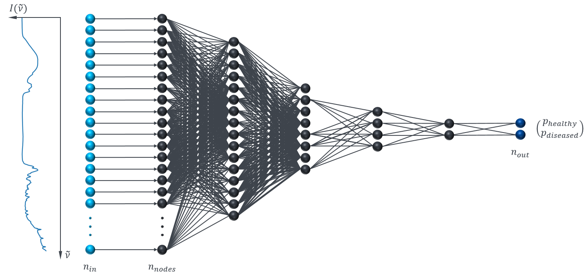
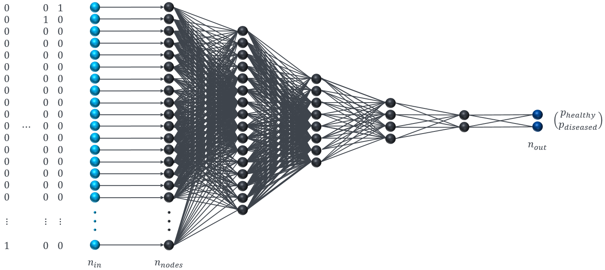

# SpecNet
*SpecNet* is a python package that enables feature selection algorithms embedded 
in a neural network architecture. It combines a leave-one-out cross-validation 
(LOOCV) type of feature selection algorithm with recursive pruning of the input 
nodes, such that only the most relevant nodes with the richest information are 
kept for the subsequent optimization task. The recursive pruning is undertaken 
by employing a ```FeatureSelection``` callback at certain points of the 
optimization process. The precise procedure is explained in *Sequence of 
Events*.
Originally developed for serving the task of finding biomarkers in biological 
tissues, the algorithm is generically coded such that it is able to select 
features for all kinds of classification tasks.

The package is an extension for the [keras](https://www.keras.io) and 
[tensorflow](https://www.tensorflow.org/) libraries.
Please see the links for further information on their software packages and to 
get a grasp of neural networks in general and the constructs used for 
*SpecNet*.

## Sequence of Events

1. Initiallizing Neural Network
	The first step of the algorithm can be thought of a simple optimization 
	problem initiallized with the inputs and a binary mask for those inputs 
	with only ones as its entries. This behaviour is induced by using a newly 
	created layer type called ```LinearPass```.
	
2. Training until trigger conditions are met
	The neural network optimizes the classification results until one of the 
	following options happen:
	- the training (or validation) loss value is beneath a certain threshold
	- the training (or validation) accuracy value is above a certain threshold
	Then - for the sake of consistency - it will count how many times in a row
	the conditions are met. If this happens for multiple epochs, the actual
	pruning event will start that consists of estimating the importance and 
	eliminating uninformative features.
3. Importance estimation
	As soon as the callback is triggered, the evaluation of the 
	

## Release Information
**0.0.1 - Initial Release**
- callback FeatureSelection
	- trigger parameters: delta epochs, thresholds, ...
	- different metrics for triggering
	- etc.
- layer LinearPass

# ToDos
Until now, only dense layered architectures are supported. The plan is to also
include convolutional layers.

[x] DenseLayer support

[x] accuarcy and loss based evaluation

[ ] ConvLayer support

[ ] intermediate layers shall be supported

[ ] paper on algorithm


